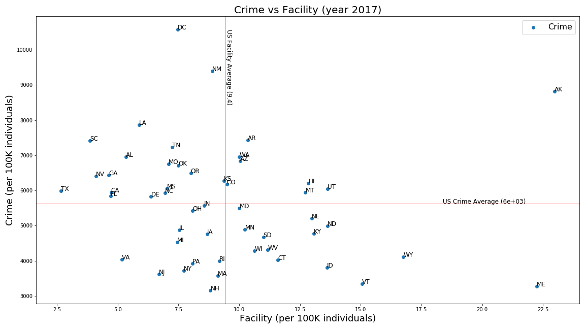
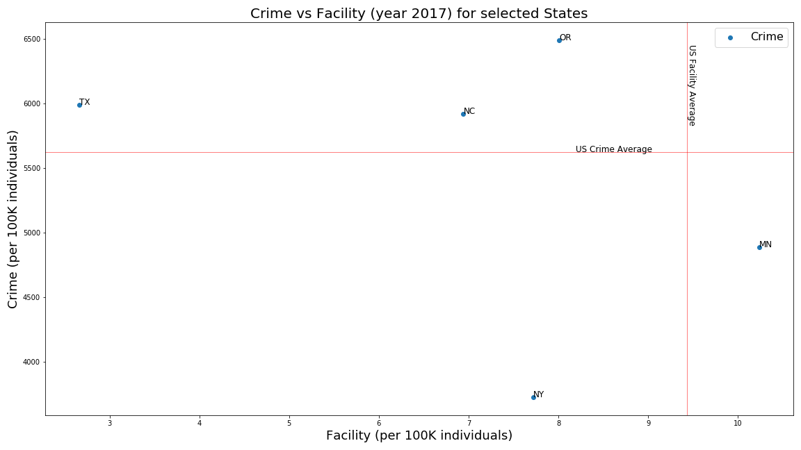
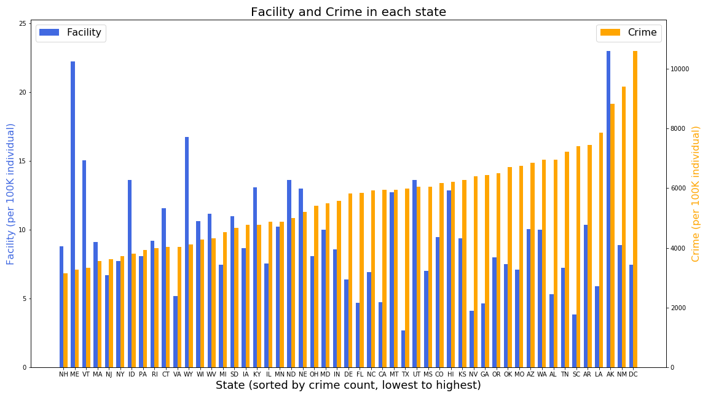
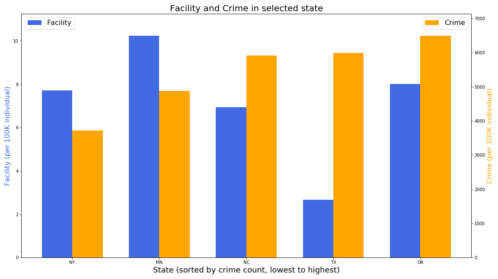

# 13 Reasons Py 
## Project Work - Group 3 - UOM Data Analysis and Visualization Bootcamp

## Project Presentation
* [13 Reasons Py - Project Presentation](/13 Reasons.pptx)

## Complete Jupyter Notebook Code
* [13 Reasons Py - Analysis and Visualization](/13ReasonsPy.ipynb)
* [Crime Data - API data pull](/CrimeData.ipynb)

### Data Files
* [Mental Health and Substance Abuse Facility Data - from SAMHSA Download](/Resources/MentalHealth_SubstanceAbuse_Facilities.csv)
* [FBI Crime Data - from CrimeData API call](/Resources/CrimeData.csv)
* [List of states](/Resources/StateAbbr.csv)

### Plots & Resource snapshot for 13-Reasons-Py Analysis
* [Plots & Resources Page](/Output)

### 1. Crime Vs Facility Scatter Plot for all states
* Crime Vs Facility Scatter Plot, showing crime in each state, ploted against the available Mental Health and Substance Abuse facility.

### 2. Crime Vs Facility Scatter Plot for states MN, NC, NY, OR & TX 
* Crime Vs Facility Scatter Plot, showing crime in each state, ploted against the available Mental Health and Substance Abuse facility.

### 3. Crime & Facility Bar Chart for all states 
* Crime & Facility barchart for all states, sorted by crime lowest to crime highest.

### 4. Crime & Facility Bar chart Plot for states MN, NC, NY, OR & TX 
* Crime & Facility barchart for states MN, NC, NY, OR & TX, sorted by crime lowest to crime highest.

### Thank you 

This work is part of the `Project 1 - UOM Data Analysis and Visualization Bootcamp`.

Submited by : 
  Claudia Ahrens
  Ganeshkumar Gurunathan
  Janet Namulondo
  Kaylin McLeod
  William Taborn
